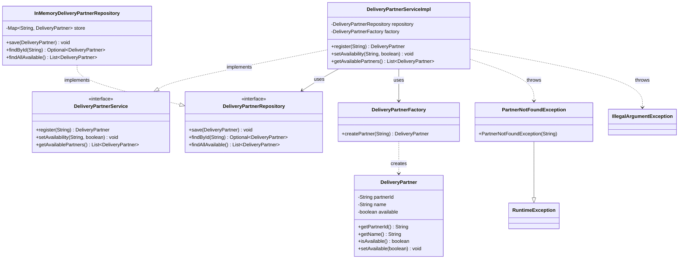
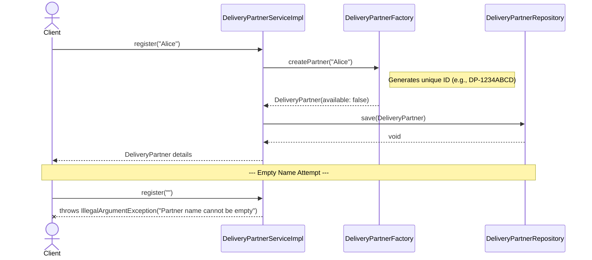
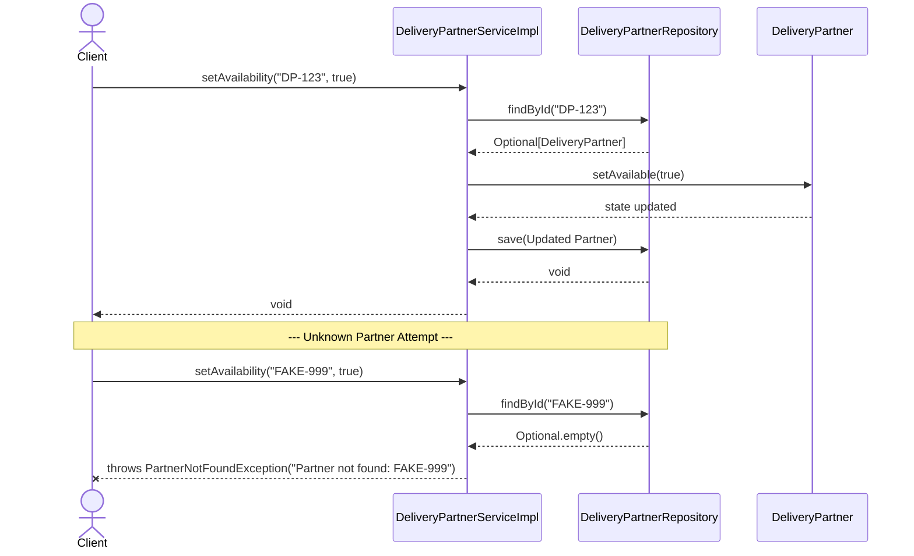
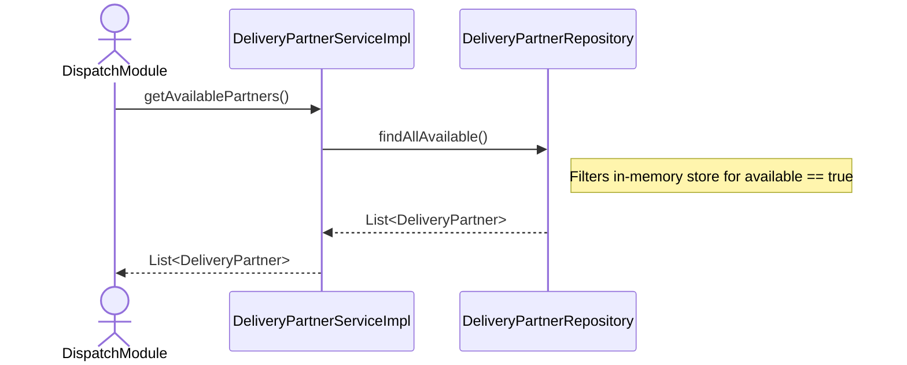

# Team 11 — Delivery Partner Management (Team PARACETEMOL)

## Team Members

| Name | GitHub Handle |
| :--- | :--- |
| **Shashank Karajagi** | [@PEEKAY04](https://github.com/PEEKAY04) |
| **Samarth M Bharadwaj** | [@samarth2505](https://github.com/samarth2505) |
| **Rishab Shetty** | [@RishabShetty16](https://github.com/RishabShetty16) |
| **Sanchit Etagi** | [@san38it](https://github.com/san38it) |

---

## Module Overview

**Package:** `edu.classproject.delivery`  
**Dependencies:** None (Zero dependencies on other modules)

This module handles the registration of delivery partners, management of their availability status (online/offline), and querying of the active fleet for dispatch operations within the food-delivery platform.

---

## Class Diagram



---

## Sequence Diagram — Partner Registration (Happy Path + Invalid Input)



---

## Sequence Diagram — Toggling Availability (Happy Path + Not Found Check)



---

## Sequence Diagram — Fetching Available Fleet



---

## Assumptions

1. **Initial State:** Newly registered delivery partners are marked as `offline` (`available = false`) by default. They must explicitly toggle their status to `true` before they can receive dispatch assignments.
2. **ID Generation:** Partner IDs are automatically generated using a truncated UUID prefixed with `DP-` (e.g., `DP-A1B2C3D4`) by the Factory pattern.
3. **Validation:** A partner's name cannot be null or empty string during registration.
4. **Data Persistence:** Currently utilizing an In-Memory adapter (`InMemoryDeliveryPartnerRepository`). The system assumes data is ephemeral and will reset upon application restart until a real database adapter is implemented.
5. **No Direct Instantiation:** Other modules must not instantiate `DeliveryPartnerServiceImpl` directly. Dependencies must be injected via the `DeliveryPartnerService` interface to honor Dependency Inversion.

---

## Integration Points

| Consuming Module | What they use | Interface |
| :--- | :--- | :--- |
| **Team 12 — Dispatch Assignment** (`dispatch`) | Fetches the list of currently online partners to assign an order. | `DeliveryPartnerService.getAvailablePartners()` |
| **Team 17 — Admin Analytics** (`analytics`) | May read partner data for daily active driver metrics. | `DeliveryPartnerService.getAvailablePartners()` |
| **Bootstrap / Demo** (`bootstrap`) | Registers demo drivers and toggles availability for the system walkthrough. | `DeliveryPartnerService.register()`, `DeliveryPartnerService.setAvailability()` |

*Note: All consumers depend entirely on the `DeliveryPartnerService` interface, strictly avoiding coupling with the underlying data store or implementation logic.*

---

## How to Run Tests

To execute tests specifically for the Delivery Partner Management module, run:
```bash
mvn test -Dtest="edu.classproject.delivery.*"
```

To run the entire suite of tests across all team modules:
```bash
mvn test
```